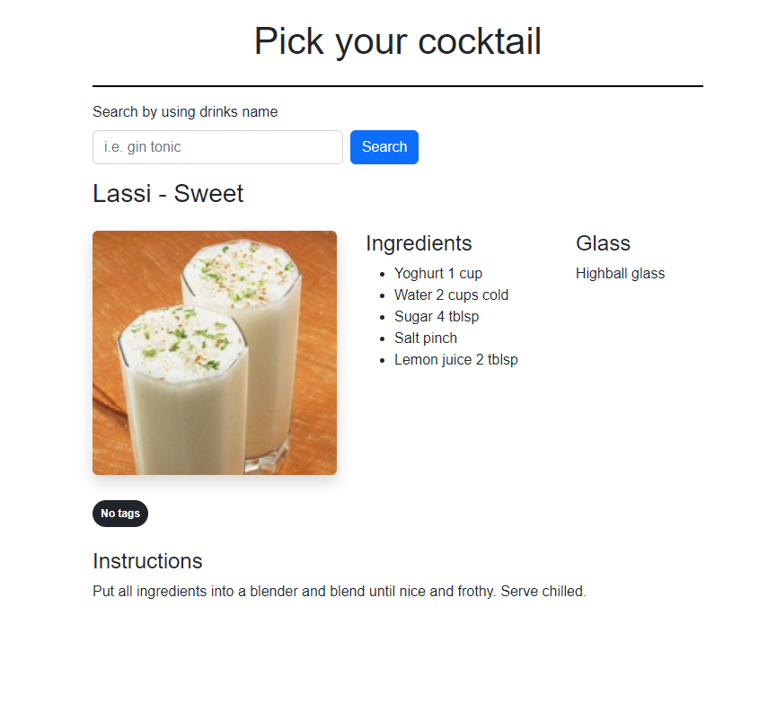
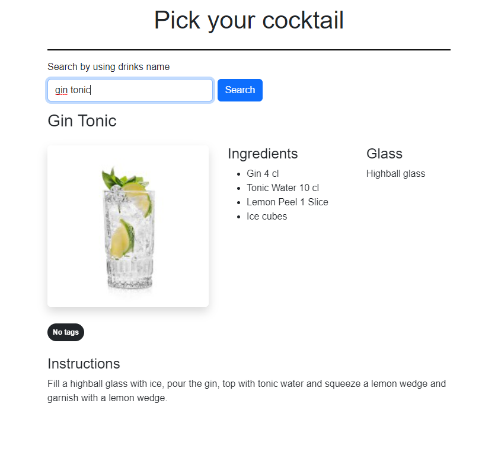

# Pick your drink

Fetches drink recipies from [Cocktail database](https://www.thecocktaildb.com). Made with React and Bootstrap 5.

--- 
## How to run

- `npm i` to install dependencies
- `npm start` to start the programg on [http://localhost:3000](http://localhost:3000)

---
## Screenshots

Random drink that is fetched on page load

Specific drink that is fetched when user searches
